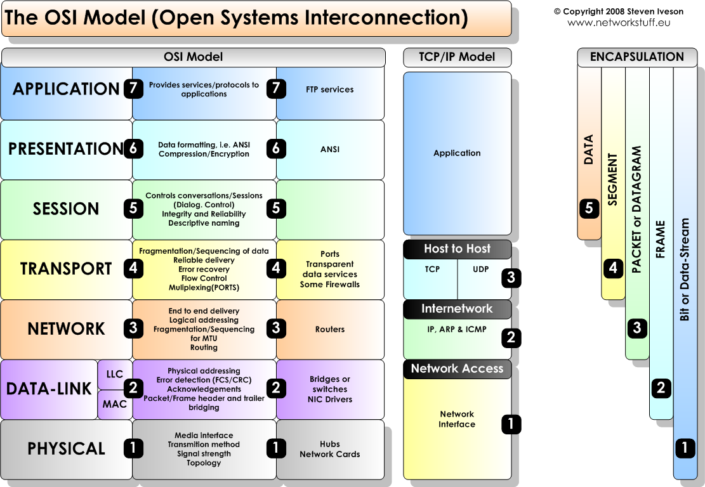

##Links
- https://en.wikipedia.org/wiki/OSI_model

## OSI model layers

### Layer 1: Physical

| _ | _ |
| --- | --- |
| Role | It is responsible for transmission and reception of unstructured raw data in a physical medium. |
| Hardware | Hubs |
| Unit | Bit |
| Protocols | Ethernet / IEEE 802.11 (Wi-Fi) / Bluetooth |

###Layer 2: Data Link

| _ | _ |
| --- | --- |
| Role | Provides node-to-node data transfer—a link between two directly connected nodes. |
| Hardware | Switch |
| Unit | Frame |
| Protocols | ARP / PPP / VLAN |

###Layer 3: Network

| _ | _ |
| --- | --- |
| Role | Provides the means of transferring variable length data sequences from one node to another connected to the same network. It translates logical network address into physical machine address. |
| Hardware | Router |
| Unit | Packet |
| Protocols | ICMP / IPv4 / IPv6 / GRE / OSPF |

###Layer 4: Transport

| _ | _ |
| --- | --- |
| Role | Provides the means of transferring variable-length data sequences from a source to a destination host via one or more networks, while maintaining the quality of service. |
| Unit | Segment (tcp) / Datagram (udp) |
| Protocols | TCP / UDP |

###Layer 5: Session

| _ | _ |
| --- | --- |
| Role | The session layer controls the dialogues (connections) between computers. It establishes, manages and terminates the connections between the local and remote application. |
| Unit | Data |
| Protocols | BGP / SOCKS / NFS / PPTP / SMB |

###Layer 6: Presentation

| _ | _ |
| --- | --- |
| Role | Responsible of formating the data: translates, encrypts and compresses, ... |
| Unit | Data |
| Protocols | TLS / SSL (Encryption) / ASCII / GIF / JPEG |

###Layer 7: Application

| _ | _ |
| --- | --- |
| Role | User - Network interaction point |
| Unit | Data |
| Protocols | HTTP / HTTPS / BitTorrent / DNS / DHCP / FTP / IMAP / NTP / SSH |
